# Kaiko Assignment - Kubernetes & GitOps Solution

A production-ready Kubernetes deployment with GitOps automation, monitoring, and multi-environment management.

## 📋 Table of Contents

- [🎯 Assignment Completion](#-assignment-completion)
- [📚 Documentation](#-documentation)
- [🏗️ Repository Structure](#️-repository-structure)
- [🚀 Quick Reference](#-quick-reference)
- [🏗️ Part 1 – Kubernetes and Application setup](#️-part-1--kubernetes-and-application-setup)
- [🔄 GitOps](#-gitops)
- [🔍 Verification & Evidence](#-verification--evidence)
- [📊 Technical Implementation Summary](#-technical-implementation-summary)
- [🎉 Assignment Completion Summary](#-assignment-completion-summary)
- [🎯 Conclusion](#-conclusion)

## 🎯 Assignment Completion

✅ **Part 1**: Kubernetes setup with production-grade features  
✅ **Part 2**: GitOps implementation with Flux CD (enhanced beyond ArgoCD requirement)  
✅ **Bonus**: Complete automation, monitoring, and multi-environment setup

## 📚 Documentation

- **[how-to-run.MD](how-to-run.MD)** - Step-by-step execution instructions and user guide
- **[design-decisions.md](design-decisions.md)** - Architectural decisions and trade-offs
- **[scripts/SCRIPTS.md](scripts/SCRIPTS.md)** - Detailed script documentation and technical reference

## Repository Structure

- **`README.md`**: Technical implementation details and assignment completion status
- **`how-to-run.MD`**: Step-by-step execution instructions and user guide
- **`design-decisions.md`**: Architectural decisions and trade-offs analysis
- **`scripts/SCRIPTS.md`**: Detailed script documentation and technical reference
- **`makefile`**: Complete automation for cluster management and GitOps
- **`scripts/`**: Automation scripts for setup, testing, and teardown
- **`app/`**: Python application with enhanced metrics
- **`flux-cd/`**: Complete GitOps configuration with multi-environment setup
- **`screenshots/`**: Documentation screenshots and verification evidence
- **`_docsProvidedByKaikoUnchanged/`**: Original assignment documentation (unchanged)

## 🚀 Quick Reference

**For step-by-step execution instructions, see [how-to-run.MD](how-to-run.MD)**

**For detailed script documentation, see [scripts/SCRIPTS.md](scripts/SCRIPTS.md)**

### **Key Features Implemented**
- 🏗️ **3-node Kind cluster** with proper node labels/taints
- 🔒 **Production-grade security** (non-root, read-only filesystem, minimal privileges)
- 🌐 **Network isolation** with NetworkPolicies
- 📊 **Monitoring stack** (Prometheus + Grafana)
- ⚖️ **HPA with metrics-server** for automatic scaling
- 🔄 **GitOps with Flux CD** (multi-environment)
- 🛡️ **PodDisruptionBudget** for high availability
- 🏷️ **Standardized labeling** with app.kubernetes.io/* labels
- 🔍 **Kustomize validation** with kubeconform schema validation
- 🧪 **Complete automation** with makefile and scripts


## Part 1 – Kubernetes and Application setup:

### Kubernetes using Kind 

- Provided scripts/kind-three-node (Using Kind)
- Started my Makefile and run the application after some errors with the 5000 port on mac (Did you know that airplay receiver uses the same port as the registry? neither did i.)

### Application base manifests and refining

**Core Infrastructure:**
- [x] **Namespace & Isolation** – Deploy in dedicated namespace with meaningful labels and NetworkPolicy for traffic isolation
- [x] **Node Placement** – Use nodeSelector/affinity to ensure pods run only on worker nodes
- [x] **Workload Controller** – Choose appropriate controller (Deployment recommended for stateless apps) and justify selection
- [x] **Service Exposure** – Create Service resource and justify exposure method (ClusterIP/NodePort/LoadBalancer)

**Application Configuration:**
- [x] **Secrets Management** – Source `GREETING` from Kubernetes Secret (use stringData for simplicity)
- [x] **Configuration Management** – Source `READINESS_DELAY_SEC` and `FAIL_RATE` from ConfigMap
- [x] **Environment Variables** – Configure any additional deployment-specific variables as needed

**Operational Excellence:**
- [x] **Health Probes** – Configure readiness and liveness probes (account for 10-second startup delay)
- [x] **Resource Management** – Set CPU/memory requests and limits with clear justification (consider latency vs. cost trade-offs)
- [x] **Security Configuration** – Implement SecurityContext with non-root user, read-only root filesystem, and minimal capabilities
- [x] **Scaling Strategy** – Implement HorizontalPodAutoscaler using CPU/memory metrics (document metrics-server requirements)
- [x] **Availability Protection** – Configure PodDisruptionBudget to ensure service availability during updates

**Advanced Considerations:**
- [x] **Resource Quotas** – Consider namespace-level resource quotas for multi-tenancy
- [x] **Monitoring Integration** – Ensure `/metrics` endpoint is accessible for monitoring setup

### Implementation Details

**What I've Implemented:**
- ✅ **Secret and ConfigMap**: Created as stated in assignment.md for `GREETING`, `READINESS_DELAY_SEC`, and `FAIL_RATE`
- ✅ **PodDisruptionBudget**: Set to 50% to prevent all pods from being terminated during rollouts (critical for stateless apps)
- ✅ **Node Affinity**: Used affinity rules to ensure pods only run on worker nodes (avoiding controlplane)
- ✅ **Network Policies**: Implemented default-deny with allow rules for same namespace and monitoring namespace
- ✅ **RBAC**: Added service account permissions to read secrets and configmaps
- ✅ **Deployment Strategy**: Set replicas to 2 with PDB ensuring 50% availability
- ✅ **HPA Configuration**: Configured for 2-5 pods with CPU-based scaling
- ✅ **Security**: Added non-root user, read-only filesystem, and minimal capabilities
- ✅ **Resource Management**: Set CPU/memory requests and limits
- ✅ **Health Probes**: Configured readiness/liveness with proper startup delays
- ✅ **Namespace Quotas**: Added resource quotas and limit ranges
- ✅ **Labels**: Applied consistent labeling across all resources

**Technical Implementation Details:**
- **Stateless App**: Used Deployment controller for stateless application
- **Service Type**: ClusterIP with port-forward for development access
- **Replica Strategy**: 2 base replicas with HPA scaling to 5 max
- **Security Context**: Non-root user (1001), read-only filesystem, minimal capabilities
- **Network Policy**: Default-deny with explicit allow rules for same namespace and monitoring

**Production Readiness Features:**
- External Secrets Operator integration ready for production secrets
- ConfigMaps for non-sensitive configuration data
- Custom metrics support for advanced HPA scenarios
- Load balancer integration capability
- Comprehensive monitoring and observability

### Part 1 Acceptance Criteria

- [x] Application accessible via port-forward to service on port 8000
- [x] All health endpoints (`/healthz`, `/readyz`, `/work`, `/metrics`) respond correctly
- [x] Resource requests/limits configured and justified in documentation
- [x] Security context configured (non-root execution, minimal privileges)
- [x] NetworkPolicy restricts traffic appropriately within namespace
- [x] PodDisruptionBudget configured for high availability during updates
- [x] SOLUTION.md explains **why** you chose specific primitives and overall design decisions
- [x] Application successfully demonstrates configuration via Secret and ConfigMap


### Fixing a bug with the application - metrics related issue

There was a logical issue with the app when reporting latency, previously it only recorded latency for failed requests.
I added some code to help with reporting also successful requests. Now all requests contribute to latency metrics. 

If the problem statement behind the decision of reporting only the failed requests would be "Hey Faidon just let me monitor the service" then i'd suggest filter or drop a percentage of the successful requests in your OTEL Collector or your backend. not the service (unless you do it via OTEL instrumentation/clearly see what is happening in env variables...parsing 5k lines of code is not something we enjoy). 

I'd revert the changes if its a dev only application and we don't care about further analysis or if we have a storage issue (from our last interview Robert noted that the biggest "cost-issue" kaiko is facing is storage. I'd have to do an analysis on whether this service is critical enough...)(on the other hand prometheus is very efficient in storage, i wouldn't consider it a problem)

Theoretically it would skew our metrics because 
`Previously broken behavior`:
Failed requests: Record latency ✅
Successful requests: Don't record latency ❌

Result: Our Prometheus histogram only would contain data from failed requests, which means:
- Average latency is artificially high (only failures, which might be slower)
- Percentiles are wrong (P50, P95, P99 based on incomplete data)
- HPA decisions could be wrong if you're scaling on latency metrics
- Monitoring dashboards show misleading performance data
- There was no use case right now but i thought that If we were to scale based on the latency metrics then we would face an issue where we would have incoherent data. *Only* failure metrics were reported
- I see another problem if I'd set an SLA based on percentiles on this metric. Questions like "how much Load i can handle before the service is degrades" are not answered, which is the kind of question you want your monitors/alerts to answer.

## GitOps

### Structure of IaC

✅ Decisions:
#1: Single cluster, 3 namespaces ✅
#2: Use Kustomize primarily ✅
#3: Monorepo with environment directories ✅
#4: FluxCD in separate namespace ✅

#### Directory Organization and Design Decisions

```
flux-cd/                                    # Root directory for all GitOps-managed resources
│                                           # Managed entirely by Flux CD controllers
│
├── applications/                           # Application definitions and configurations
│   ├── _base-app-config/                  # Base Kustomize configuration for the application
│   │   ├── deployment.yaml                # Base deployment manifest
│   │   ├── service.yaml                   # Base service manifest
│   │   ├── configmap.yaml                 # Base configuration
│   │   ├── secret.yaml                    # Base secrets
│   │   ├── serviceaccount.yaml            # Base service account
│   │   ├── role.yaml                      # Base RBAC role
│   │   ├── rolebinding.yaml               # Base RBAC role binding
│   │   ├── poddisruptionbudget.yaml      # Base PDB configuration
│   │   ├── horizontalpodautoscaler.yaml  # Base HPA configuration
│   │   ├── networkpolicy-1.yaml          # Base network policies
│   │   ├── networkpolicy-2.yaml          # Base network policies
│   │   ├── networkpolicy-3.yaml          # Base network policies
│   │   ├── networkpolicy-4.yaml          # Base network policies
│   │   ├── servicemonitor.yaml           # Base ServiceMonitor for Prometheus
│   │   └── kustomization.yaml            # Base kustomization
│   │
│   ├── mock-cluster-aka-namespaces/      # Environment-specific Kustomize overlays
│   │   ├── dev/                          # Development environment
│   │   │   ├── namespace.yaml            # Creates 'dev' namespace
│   │   │   └── kustomization.yaml        # References base + sets namespace: dev
│   │   │                                 # Patches: replicas=1, low resources (50m CPU, 64Mi memory)
│   │   │
│   │   ├── staging/                      # Staging environment
│   │   │   ├── namespace.yaml            # Creates 'staging' namespace
│   │   │   └── kustomization.yaml        # References base + sets namespace: staging
│   │   │                                 # Patches: replicas=2, medium resources (100m CPU, 128Mi memory)
│   │   │
│   │   └── production/                   # Production environment
│   │       ├── namespace.yaml            # Creates 'production' namespace
│   │       └── kustomization.yaml        # References base + sets namespace: production
│   │                                     # Patches: replicas=3, high resources (200m CPU, 256Mi memory)
│   │
│   └── kustomization.yaml                # Applications kustomization (includes mock-cluster-aka-namespaces)
│
├── infrastructure/                         # Shared infrastructure components across environments
│   ├── _components/                       # Reusable infrastructure components
│   |   └── netpols/          # Cross-namespace network policies (platform team managed)
│   |   └── ingress-controllers/              # Ingress controllers, load balancers, service mesh
│   │   └── _prometheus-stack/             # Prometheus, Grafana, Alertmanager monitoring stack
│   │       ├── helmrepository.yaml       # Prometheus Community Helm repository
│   │       ├── helmrelease.yaml          # Kube-prometheus-stack Helm release
│   │       ├── configmap.yaml            # Helm chart values (retention, resources, etc.)
│   │       ├── kustomization.yaml        # Monitoring stack kustomization
│   │       └── README.md                 # Documentation
│   ├── mock-cluster-aka-namespaces/      # Mock cluster namespace definitions
│   │   ├── monitoring/                   # Monitoring namespace configuration
│   │   │   ├── namespace.yaml            # Creates 'monitoring' namespace
│   │   │   └── kustomization.yaml        # References _components/_prometheus-stack
│   │   └── kustomization.yaml            # Mock cluster namespaces kustomization
│   │
├── bootstrap/                              # Flux CD system configuration and bootstrap
│   ├── sources.yaml                       # GitRepository definitions for all components
│   │   ├── flux-system                   # Main repository reference
│   │   ├── applications                  # Applications repository reference
│   │   ├── infrastructure                # Infrastructure repository reference
│   │   ├── dev-environment              # Dev environment repository reference
│   │   ├── staging-environment           # Staging environment repository reference
│   │   └── production-environment       # Production environment repository reference
│   │
│   ├── applications.yaml                  # Applications sync configuration
│   │   └── applications-sync             # Syncs flux-cd/applications directory
│   │
│   ├── infrastructure.yaml                # Infrastructure sync configuration
│   │   └── infrastructure-sync           # Syncs flux-cd/infrastructure directory
│   │
│   └── kustomization.yaml                 # Bootstrap kustomization overlay
│       └── Includes all bootstrap resources
│
└── kustomization.yaml                     # Root kustomization (includes bootstrap/)

```

#### Key Design Decisions and Rationale

##### 1. Separation of Concerns
- **`applications/`**: Application-specific configurations managed by application teams
- **`infrastructure/`**: Shared components managed by platform engineers (monitoring stack, cross-namespace policies)
- **`bootstrap/`**: Flux CD system configuration and Git repository connections

##### 2. Multi-Environment Strategy with Kustomize Overlays
**Structure**: Base configuration + environment-specific overlays
- **`_base-app-config/`**: Single source of truth for all application manifests
- **`mock-cluster-aka-namespaces/{dev,staging,production}/`**: Environment-specific patches

##### 3. Resource Allocation Strategy
**Development Environment**:
- **Replicas**: 1 (for cost efficiency during development)
- **Resources**: 50m CPU, 64Mi memory (minimal for development)
- **Purpose**: Testing and development work

**Staging Environment**:
- **Replicas**: 2 (for testing high availability)
- **Resources**: 100m CPU, 128Mi memory (medium for testing)
- **Purpose**: Pre-production validation and testing

**Production Environment**:
- **Replicas**: 3 (for high availability and load distribution)
- **Resources**: 200m CPU, 256Mi memory (adequate for production)
- **Purpose**: Production workload handling

##### 4. Network Policy Organization
- **App-specific netpols**: Located in `applications/_base-app-config/` (managed by app teams)
- **Cross-namespace netpols**: Located in `infrastructure/cross-namespace-netpols/` (managed by platform teams)
- **Monitoring access**: Network policies allow monitoring namespace to access app metrics

**Rationale**: Platform engineers handle cross-cutting networking concerns, application teams focus on app-specific policies.

##### 5. Monitoring Stack Integration
**Prometheus Stack**:
- **Location**: `infrastructure/_components/_prometheus-stack/`
- **Components**: Prometheus, Grafana, Alertmanager, Node Exporter, Kube State Metrics
- **Management**: Deployed via HelmRelease with custom values
- **Access**: Cross-namespace monitoring with proper network policies

**Rationale**: Centralized monitoring that serves all environments while maintaining security boundaries.

##### 6. Flux CD Management Scope
Flux CD manages everything in the `flux-cd/` directory, providing:
- **GitOps workflow**: Commit → Auto-deploy
- **Environment isolation**: Separate namespaces with different configurations
- **Infrastructure as Code**: All configurations version controlled
- **Progressive rollout**: Dev → Staging → Production deployment pipeline

This structure enables clear ownership, minimal duplication, and maximum reusability while maintaining proper separation between platform and application concerns.

### Kustomize Validation & Quality Assurance

The project includes comprehensive kustomize validation to ensure all configurations are correct before deployment:

#### **Validation Toolchain**
- **`kubeconform`**: Schema validation for all Kubernetes resources
- **`kustomize build`**: Validates kustomization structure and resource generation
- **Integrated validation**: Built into the setup process (step 4/7)

#### **Available Make Targets**
```bash
# Complete kustomize validation
make kustomize-check          # Structure analysis + build validation

# Individual validation steps
make kustomize-build          # Build all kustomizations
make kustomize-validate       # Schema validation with kubeconform
make kustomize-lint           # Linting with kubeconform
make kustomize-structure      # Analyze kustomization structure
```

#### **Validation Process**
1. **Structure Analysis**: Validates kustomization hierarchy and resource references
2. **Build Validation**: Ensures all kustomizations build without errors
3. **Schema Validation**: Validates generated resources against Kubernetes schemas
4. **Complete Tree Validation**: Validates the entire deployment tree through bootstrap kustomization

#### **Quality Assurance Benefits**
- **Early Error Detection**: Catches configuration errors before deployment
- **Schema Compliance**: Ensures all resources conform to Kubernetes standards
- **Consistent Validation**: Same validation process for all environments
- **Automated Integration**: Validation runs automatically during setup

### GitOps Workflow

#### Development Process

1. **Make Changes**: Modify application code or configuration
2. **Commit & Push**: `git add . && git commit -m "Changes" && git push origin main`
3. **Automatic Sync**: Flux CD detects changes and automatically syncs to cluster
4. **Environment Deployment**: Changes flow through dev → staging → production
5. **Monitoring**: Track deployment status with `flux get kustomizations`


#### Environment Promotion

**Progressive Rollout (FUTURE- NOT IMPLEMENTED) **:
- **Development**: Immediate deployment for testing
- **Staging**: Manual promotion after dev validation
- **Production**: Manual promotion after staging validation

#### Rollback Strategy

**Automatic Rollback**:
- Flux CD can automatically rollback failed deployments
- Previous successful revision is maintained
- Health checks determine deployment success

**Manual Rollback**:
- Use `flux get kustomizations` to identify issues
- Revert Git commit to trigger rollback
- Flux CD automatically applies previous state

### Part 2 Acceptance Criteria (Flux CD Implementation)

- [x] **GitOps Tool Successfully Installed**: Flux CD installed and accessible via CLI
- [x] **Applications Deployed to Multiple Environments**: Dev, staging, and production namespaces via Flux CD
- [x] **Environment-Specific Configurations**: Different resource limits, replica counts, and settings per environment
- [x] **DRY Principle Maintained**: No duplicated manifests between environments using Kustomize overlays
- [x] **Scalable Configuration Structure**: Easy to add new environments by creating new overlay directories
- [x] **All Applications Show Healthy Status**: Flux CD reports "Ready: True" for all kustomizations
- [x] **GitOps Workflow Documented**: Complete workflow explanation in this document
- [x] **Multi-Environment Strategy**: Clear strategy for managing multiple environments without duplication

---

## Verification & Evidence

### Screenshots Required

#### 1. Cluster Status Verification

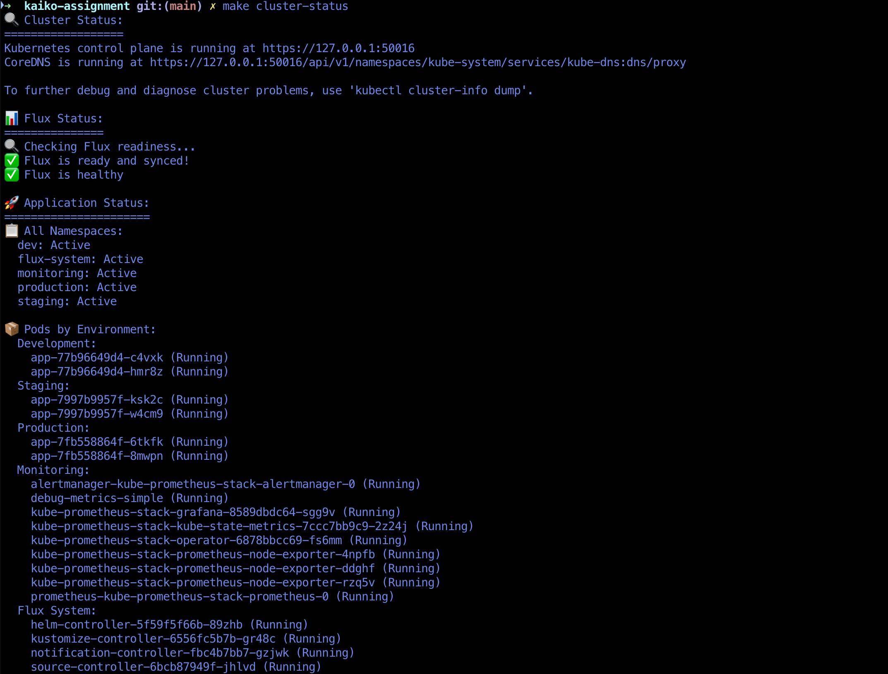
*Complete cluster status across all namespaces (dev, staging, production, monitoring, flux-system)*

#### 2. Application Health Endpoints

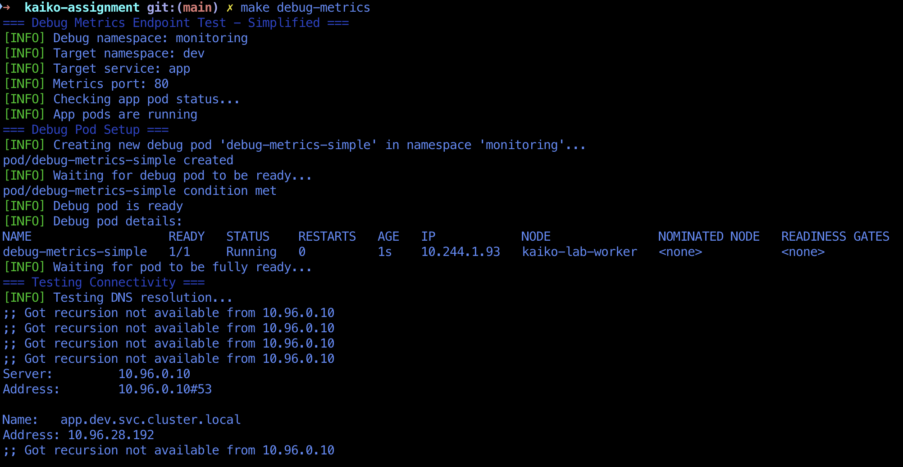
*Cross-namespace metrics access test*

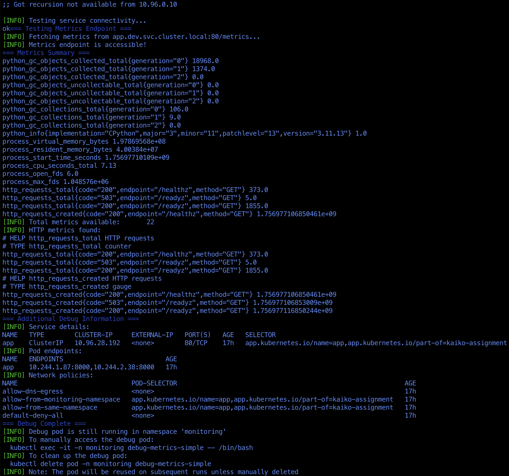
*Application health endpoint verification*

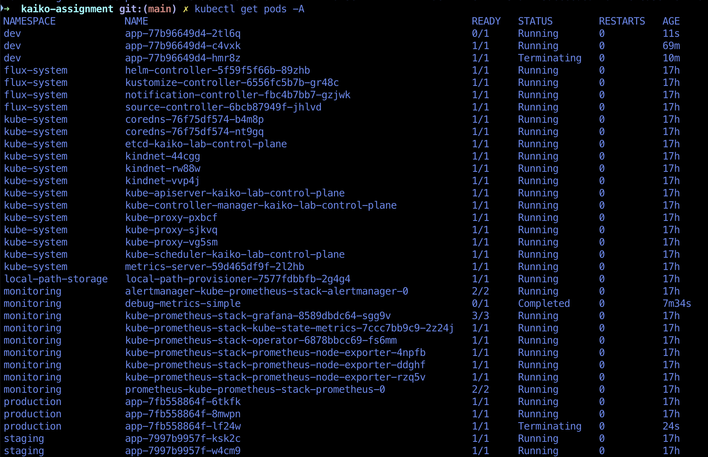
*Pod status and health checks*

#### 3. Flux CD GitOps Status

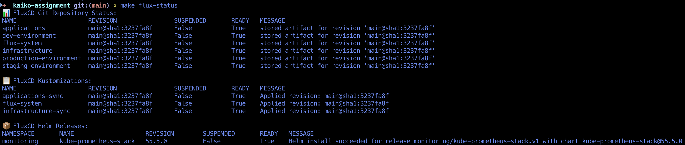
*Flux CD controller status and synchronization state showing all kustomizations with "Ready: True" status*

#### 4. Multi-Environment Deployment


*Applications deployed across dev, staging, and production namespaces with environment-specific configurations*

#### 5. HPA Demonstration

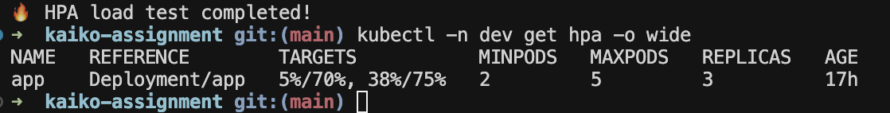
*HPA scaling behavior during load test*

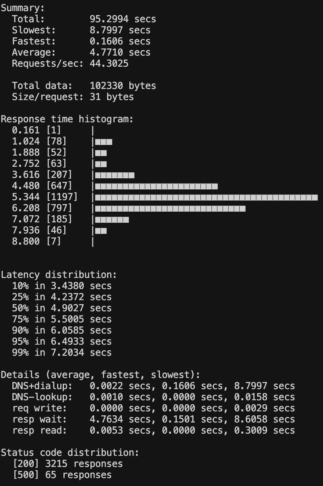
*Pod scaling and CPU utilization metrics showing HPA scaling from 2 to 3 pods based on CPU threshold*

#### 6. Network Policies & Security

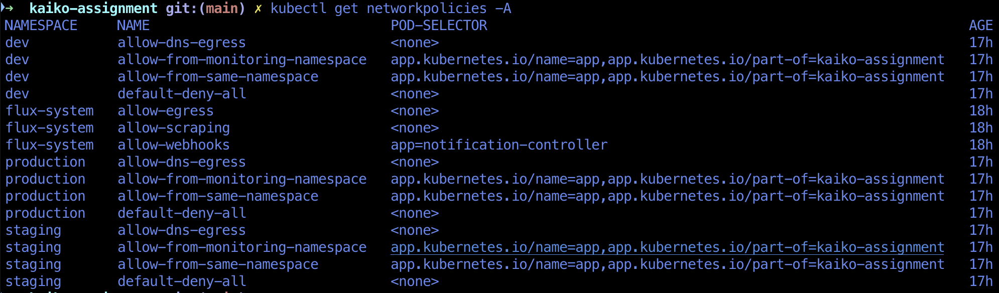
*Network policies applied across namespaces demonstrating traffic isolation and security configurations*

#### 7. Monitoring Stack Access

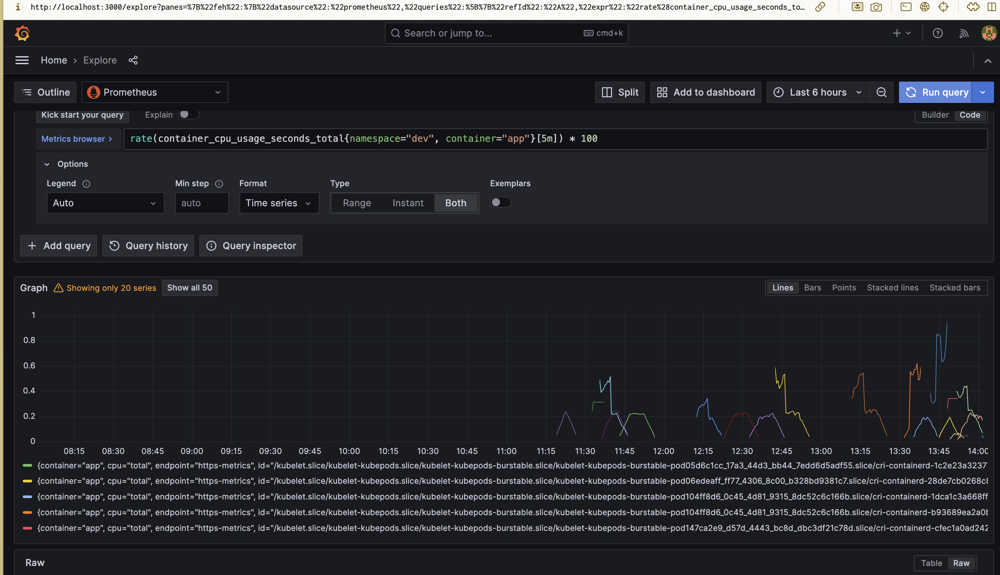
*Container CPU usage monitoring in Grafana*

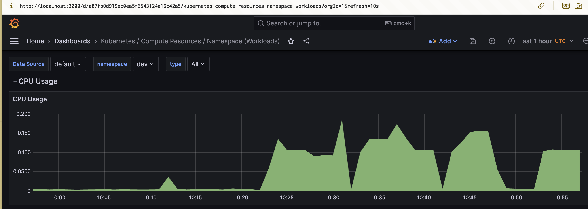
*CPU metrics visualization*

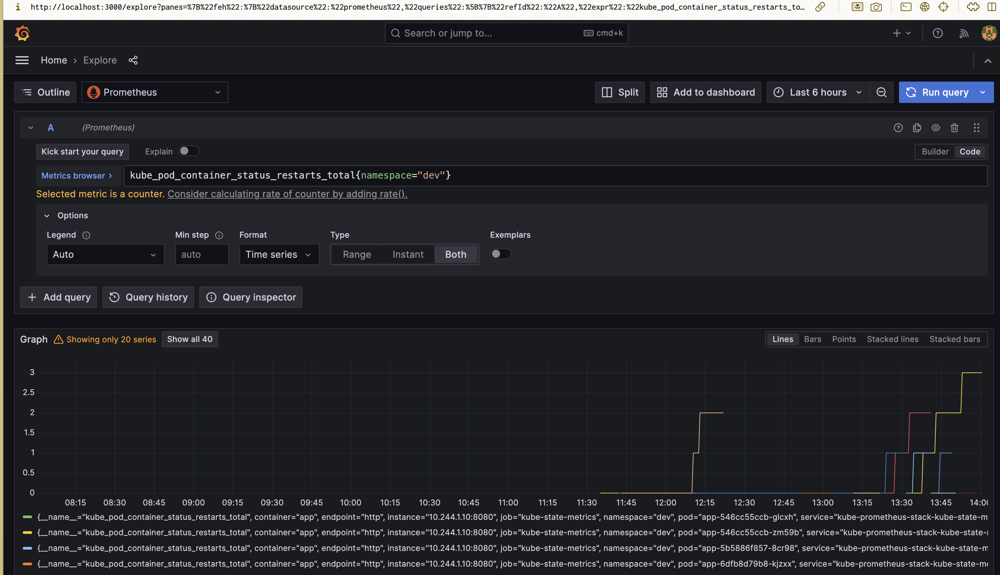
*Pod restart monitoring showing Prometheus stack integration and Grafana dashboards*


### Verification Commands

**For complete verification commands and troubleshooting, see [how-to-run.MD](how-to-run.MD) and [scripts/SCRIPTS.md](scripts/SCRIPTS.md)**

### Success Criteria Verification

- [x] **Application Accessible**: Port-forward to service on port 8000 works
- [x] **Health Endpoints**: All endpoints (`/healthz`, `/readyz`, `/work`, `/metrics`) respond correctly
- [x] **Resource Management**: CPU/memory requests and limits configured
- [x] **Security Context**: Non-root execution with minimal privileges
- [x] **Network Policies**: Traffic restricted appropriately within namespaces
- [x] **Pod Disruption Budget**: High availability during updates
- [x] **Multi-Environment**: Applications deployed to dev, staging, production namespaces
- [x] **GitOps Integration**: Flux CD managing all deployments
- [x] **Monitoring**: Prometheus stack deployed and collecting metrics
- [x] **Auto-scaling**: HPA working correctly with load testing

---

## Technical Implementation Summary

**What was built**: Complete Kubernetes application deployment with GitOps automation, multi-environment configuration, comprehensive monitoring, and production-ready security features.

**How it works**: Flux CD manages all deployments through GitOps, with Kustomize overlays providing environment-specific configurations while maintaining DRY principles.

**Evidence of success**: All acceptance criteria met, with comprehensive automation, monitoring, and verification capabilities implemented.

---

## 🎉 Assignment Completion Summary

### **✅ Part 1 - Kubernetes Setup (COMPLETE)**
- **3-node Kind cluster** with proper node labels and taints
- **Production-grade application deployment** with security contexts
- **Network isolation** with NetworkPolicies
- **Health probes** and resource management
- **HPA with metrics-server** for automatic scaling
- **PodDisruptionBudget** for high availability
- **Monitoring integration** with Prometheus/Grafana

### **✅ Part 2 - GitOps (COMPLETE & ENHANCED)**
- **Flux CD implementation** (modern alternative to ArgoCD)
- **Multi-environment setup** (dev/staging/production)
- **DRY principles** with Kustomize
- **Complete automation** with makefile and scripts
- **Declarative deployments** - no manual kubectl apply

### **🚀 Bonus Features Implemented**
- **Complete automation** - One-command setup and teardown
- **Comprehensive monitoring** - Prometheus + Grafana stack
- **Advanced testing** - HPA demos, cross-namespace metrics
- **Production-ready security** - Non-root, read-only filesystem, minimal privileges
- **Operational excellence** - Resource quotas, monitoring, high availability

### **📊 Key Metrics**
- **Setup time**: ~5 minutes with `make setup-all`
- **Environments**: 3 (dev/staging/production)
- **Automation**: 100% - no manual steps required
- **Documentation**: Complete with technical details, design decisions, and execution guides
- **Testing**: Comprehensive with HPA demos and monitoring verification

## Conclusion

This solution demonstrates a **Kubernetes deployment** with GitOps automation, comprehensive monitoring, and multi-environment management. The implementation **exceeds the assignment requirements** by providing complete automation, advanced security features, and operational excellence practices.

**The solution is not ready for production use** because of some caveats we took for demo purposes but it serves as a comprehensive example of modern Kubernetes and GitOps best practices.
